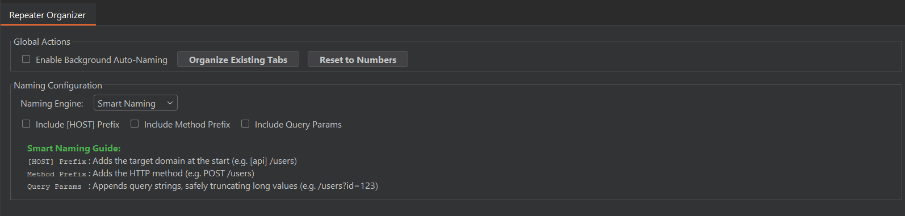
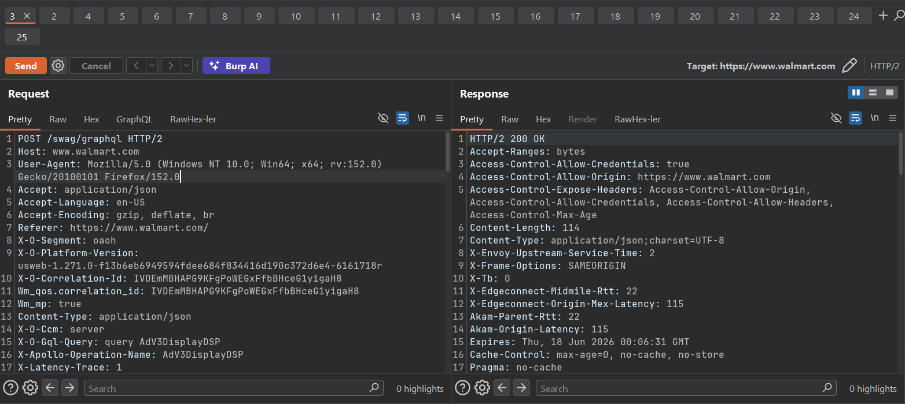
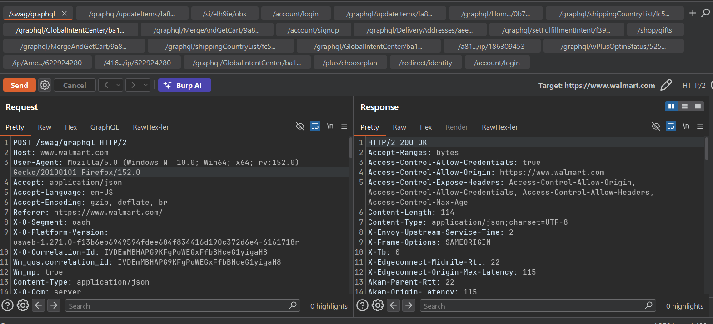
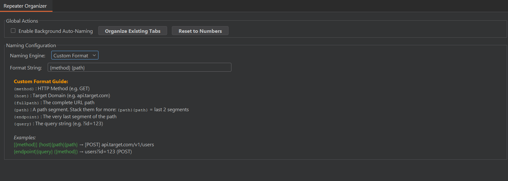

  
  <h1>Repeater Organizer</h1>
  
افزونه‌ای قدرتمند برای Burp Suite جهت نام‌گذاری و مرتب‌سازی خودکار تب‌های Repeater.

  [**🇺🇸 English**](README.md) | [**🇮🇷 فارسی**](README-fa.md)

---

## 🌍 درباره افزونه

افزونه Repeater Organizer یک ابزار کاربردی برای Burp Suite است که با زبان Python (Jython) نوشته شده و به صورت خودکار تب‌های Repeater شما را بر اساس محتوای درخواست‌های HTTP نام‌گذاری و مدیریت می‌کند. با این افزونه می‌توانید از شر تب‌های بی‌معنی با نام‌های عددی (1، 2، 3...) خلاص شوید و درخواست‌ها را فوراً از طریق Method، Host، Path و پارامترهای Query تشخیص دهید.

---

## ✨ امکانات

- 🔄 **Background Auto-Naming:** به محض ارسال یک درخواست به Repeater (مثلاً با زدن `CTRL+R`)، به صورت خودکار تب جدید را در بک‌گراند نام‌گذاری می‌کند.
- 🧠 **Smart Naming Engine:** به صورت هوشمندانه بهترین مسیر (Path) را از درخواست استخراج کرده و رشته‌های بسیار طولانی را کوتاه (Truncate) می‌کند.
- ⚙️ **Smart Options:**
  - `Include [HOST] Prefix`: دامنه هدف (Domain) را به نام اضافه می‌کند.
  - `Include Method Prefix`: متد HTTP را اضافه می‌کند.
  - `Include Query Params`: پارامترهای Query را به نام تب متصل می‌کند.
- 🛠️ **Custom Format Engine:** کنترل کامل روی نام تب‌ها با استفاده از متغیرهای داینامیک (مثال: `[{method}] {host}{path}{path}`).
- 🗂️ **Organize Existing Tabs:** تغییر نام گروهی و یکباره تمام تب‌های باز فعلی تنها با یک کلیک.
- ⏪ **Reset to Numbers:** بازگردانی امن تمام تب‌ها به حالت پیش‌فرض و شماره‌گذاری عددی.

---

## 📸 تصاویر محیط کار

  
  
   
  <i>قبل و بعد: عملکرد Smart Naming</i>

 

  
   
  <i>پیکربندی Custom Format Engine</i>

---

## 🚀 نصب

1. فایل [Jython Standalone JAR](https://www.jython.org/download) را دانلود کرده و به Burp Suite خود اضافه کنید (در مسیر `Extender` -> `Options` -> `Python Environment`).
2. اسکریپت `repeater_organizer.py` را از این ریپازیتوری دانلود کنید.
3. در نرم‌افزار Burp Suite به تب `Extender` -> `Extensions` بروید.
4. روی `Add` کلیک کنید، قسمت `Extension Type` را روی `Python` قرار داده و فایل `repeater_organizer.py` را انتخاب کنید.
5. تب جدیدی با نام **Repeater Organizer** به رابط کاربری (UI) شما در Burp Suite اضافه خواهد شد.

---

## 🛠️ راهنما و متغیرها

### متغیرهای Custom Format
هنگام استفاده از **Custom Format Engine**، می‌توانید قالب نام‌گذاری اختصاصی خود را با استفاده از متغیرهای زیر بسازید:

| متغیر | توضیحات | نمونه خروجی |
|-------|---------|-------------|
| `{method}` | متد HTTP | `GET`, `POST` |
| `{host}` | دامنه هدف | `api.target.com` |
| `{fullpath}` | مسیر کامل URL | `/v1/users/create` |
| `{path}` | یک بخش از مسیر. ترکیب آن‌ها: `{path}{path}` | `users/create` |
| `{endpoint}` | آخرین بخش از مسیر | `create` |
| `{query}` | پارامترهای Query | `?id=123` |

**نمونه‌های استفاده:**
- قالب `[{method}] {host}{path}{path}` تبدیل می‌شود به &larr; `[POST] api.target.com/v1/users`
- قالب `{endpoint}{query} ({method})` تبدیل می‌شود به &larr; `users?id=123 (POST)`

---

## 🤝 مشارکت
ما از مشارکت‌ها، گزارش باگ و درخواست ویژگی‌های جدید استقبال می‌کنیم!

## 📄 لایسنس
این پروژه تحت لایسنس MIT منتشر شده است.

